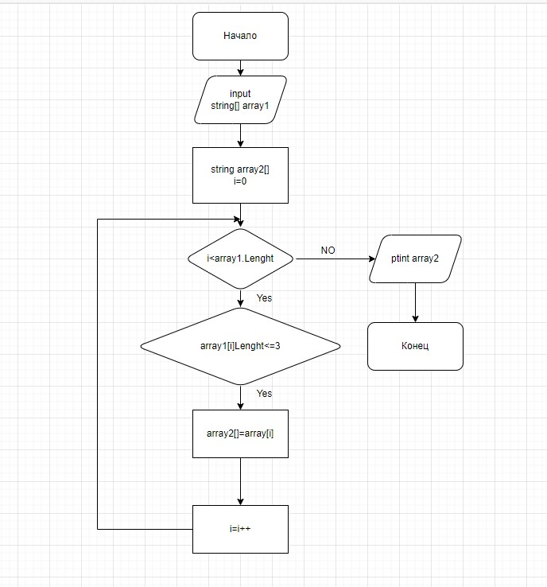

**Контрольная работу " Итоги блока. Выбор специализации. IT-специалист"**

***Задача***: Написать программу, которая из имеющегося массива строк формирует новый массив из строк, длина которых меньше, либо равна 3 символам. Первоначальный массив можно ввести с клавиатуры, либо задать на старте выполнения алгоритма. При решении не рекомендуется пользоваться коллекциями, лучше обойтись исключительно массивами.

Примеры:

[“Hello”, “2”, “world”, “:-)”] → [“2”, “:-)”]
[“1234”, “1567”, “-2”, “computer science”] → [“-2”]
[“Russia”, “Denmark”, “Kazan”] → []

**Описание выполнения контрольной работы**

1. Создание репозитория с файлом Readme.md, разработка Блок схемы , использование контроль версии, дальнейшая выгрузка в GitHub

2. Основные шаги решения задачи на языке C# :
    
    a.  Создание методов для :

        1. Формирования первоначального массива(return) с типом данных String . 
        На вход и выход - массив.  в качестве аргумеента массивы указываем размер массива с типом int,поэтому используем Convert.ToString.  Данный массив состоит из элементов водимые пользователем.

        2. Формирования массива в соответствие с условием задачи. В данный массив будут входить строки из первоначального массива , при условии что длина строк меньше либо равно 3.
            Для этого инициализируем массив. Запускаем цикл равный длине массива , задаем условие ,чтобы поочередной перебрать все элементы массива , где будут выявлены строки в которыъ длина будет = либо <3 которые и будут записаны в новый массив.
        
        3. Вывода массива.  ЗАпускаем цикл , где перебераются поочередно элементы массива и при помощи  Console.WriteLine  выводятся на экран.
    
    b.  Написание программы : 
        1. Вызова метода №1. Создаем новую переменну= методу №1 
        2. Вызов метода №3 для вывода первоначального массива на экран.
        3. Вызов метода №2. Создаем новую переменну= методу №2
        4. Вызов метода №3 для вывода массива на экран.

3. Отправка репозитория GitHub на проверку

         
